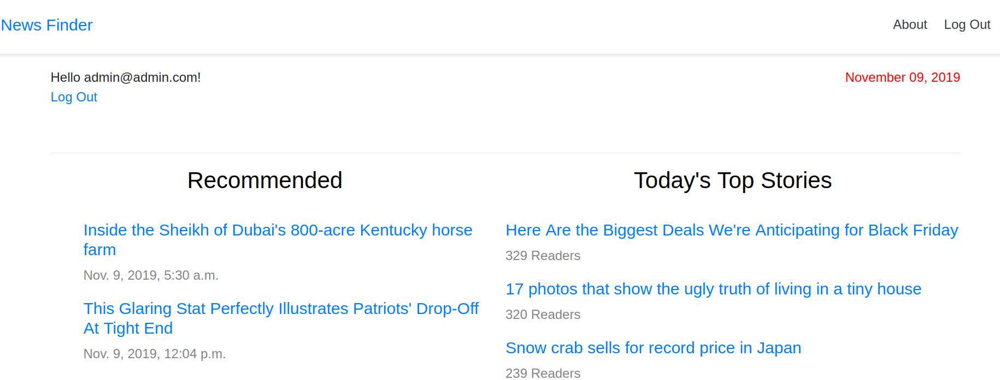
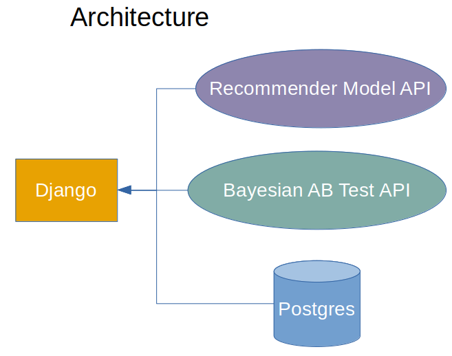

# news-recommender
A Django website for browsing the latest news and recommended news based on user click history.

Its purpose is to serve as a minimal website to explore and test recommender systems, and AB testing.



New users can be created with Django Admin, and each user will see different recommendations based on their click 
history.

The website is set up to run on 1 recommender model, as defined by the environment variable in docker-compose.

The website is set up to run an AB test on the home page that will switch the order of the recommended news and top 
news columns.  

# How to Use It

To build and start the service for the first time:
```
docker-compose up --build
```

Go to http://localhost:8000

The recommender system is hosted as a separate API.  After starting the service, its Swagger docs can be found at: 
http://localhost:5000/docs

The AB testing framework is hosted as a separate API.  After starting the service, its Swagger docs can be found at:
http://localhost:5001/docs



## Admin and User Credentials

A super-user is created when the service builds.  The credentials are in the docker-compose environment variables:
```
DJANGO_SUPERUSER_PASSWORD=adminPW123
DJANGO_SUPERUSER_USERNAME=admin
DJANGO_SUPERUSER_EMAIL=admin@admin.com
```

The service creates 4,854 users with pre-defined reading histories.  So each user will see different recommendations.  
If you log in as a user and click on articles, their recommendations will update based on what you click on.  Every 
user's login info follows the same structure, where ID could be 0, 1, 2, 3, etc.
```
username=user<ID>
password=userpassword
```

## AB Testing

The default AB test compares home page layouts.  HTML template variants are stored in templates/abtest/

The AB test AP uses an analytic approach instead of MCMC.  Only A/B tests are supported, so A/B/C+ tests are unsupported 
at this time.  Feel free to add support for them.  A Beta distribution is used as the conjugate prior.

Users are assigned a variant based on the search algorithm chosen to balance exploration/exploitation.  The default is 
Thompson sampling.  Once a user is assigned a variant, they will only see that variant.  

The default test has 2 variants and some seeded data.  To modify the seed data, you will need to edit 
abtest/src/main.py.  Look at the campaign_to_variant_map and user_to_campaign_variant_map variables.

## Adding a New Recommender Model

The service is set up to work with models from Microsoft's recommenders Python library.  To add your own, you will need 
to modify recommender_system/src/models.py, add a folder in models/, and update the docker-compose environment variable.
